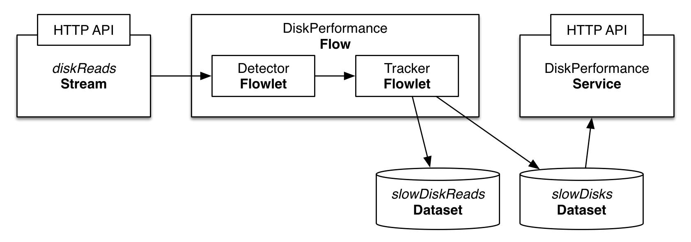

=====================================
Real-Time Data Processing with a Flow
=====================================

In this guide you will learn how to process data in real time with the Cask Data Application Platform (CDAP).
You will also learn how easy it is to scale out real-time data processing applications on CDAP.

What You Will Build
===================
You will build a CDAP application that processes disk usage information across machines in a large company in order
to identify disks that may need to be replaced soon. You will:

-   Build a `Flow <https://docs.cask.co/cdap/current/en/developers-manual/building-blocks/flows-flowlets/flows.html>`__
    to process disk usage data in real time;
-   Use `Datasets <https://docs.cask.co/cdap/current/en/developers-manual/building-blocks/datasets/index.html>`__
    to store the number of slow reads per disk and track slow disks that may need to be replaced soon; and
-   Build a `Service <https://docs.cask.co/cdap/current/en/developers-manual/building-blocks/services.html>`__
    to query via HTTP which slow disks should be replaced.

What You Will Need
==================

-   `JDK 7 or 8 <http://www.oracle.com/technetwork/java/javase/downloads/index.html>`__
-   `Apache Maven 3.1+ <http://maven.apache.org/download.cgi>`__
-   `CDAP Local Sandbox <https://docs.cask.co/cdap/current/en/developers-manual/getting-started/local-sandbox/index.html>`__

Let’s Build It!
===============
The following sections will guide you through implementing a real-time data processing application from scratch.
If you want to deploy and run the application right away, you can clone the sources from this GitHub repository.
In that case, feel free to skip the following two sections and jump directly to the
`Build and Run Application <#build-and-run-application>`__ section.

Application Design
------------------
In CDAP, you process data in real time by implementing a Flow. In this example the Flow consists of two Flowlets.
The ``Detector`` Flowlet consumes data from a ``diskReads`` Stream, parses the event, and outputs the disk ID if the event was a slow disk read.
The ``Tracker`` Flowlet reads the disk ID emitted by the ``Detector``, and updates a count of how often that disk has recorded a slow read.
If a disk has recorded too many slow reads, the disk ID is written to a separate dataset that tracks all disks that should soon be replaced.

Implementation
--------------
The recommended way to build a CDAP application from scratch is to use a Maven project.
Use the following directory structure (you’ll find contents of the files below)::

    ./pom.xml
    ./src/main/java/co/cask/cdap/guides/flow/DiskPerformanceApp.java
    ./src/main/java/co/cask/cdap/guides/flow/DiskPerformanceFlow.java
    ./src/main/java/co/cask/cdap/guides/flow/DiskPerformanceHTTPHandler.java
    ./src/main/java/co/cask/cdap/guides/flow/DetectorFlowlet.java
    ./src/main/java/co/cask/cdap/guides/flow/TrackerFlowlet.java

First create the application, which contains a stream, flow, and datasets.

.. code:: java

  public class DiskPerformanceApp extends AbstractApplication {
    static final String APP_NAME = "DiskPerformanceApp";
    static final String STREAM_NAME = "diskReads";

    @Override
    public void configure() {
      setName(APP_NAME);
      addStream(new Stream(STREAM_NAME));
      createDataset("slowDiskReads", KeyValueTable.class);
      createDataset("slowDisks", KeyValueTable.class);
      addFlow(new DiskPerformanceFlow());
      addService(DiskPerformanceHTTPHandler.NAME, new DiskPerformanceHTTPHandler());
    }
  }

Next, we create a Flow, which is composed of two Flowlets, the ``Detector`` and the ``Tracker``.
The Detector Flowlet parses disk I/O events from the Stream and emits the disk ID if the
operation is slower than a threshold. The Tracker consumes the output of the Detector Flowlet
and performs an analysis to detect a slow disk. Since a Tracker Flowlet performs dataset operations,
it may be slower than a Detector Flowlet that performs all processing in memory. Thus, it's a good idea
to have multiple Tracker Flowlet instances.

In the Flow specification below, we'll start with a single
Detector and two Tracker Flowlets.
The parser reads from the stream, and the tracker then reads from the parser.
We will set the number of ``Tracker`` instances to two.
This means that there will be two separate ``Trackers`` running, each taking turns reading what the Detector outputs.
You want to do this if a single ``Detector`` can output more quickly than a single ``Tracker`` can process.

.. code:: java

  public class DiskPerformanceFlow extends AbstractFlow {
    static final String NAME = "DiskPerformanceFlow";

    @Override
    public void configure() {
      setName(NAME);
      setDescription("Tracks slow disks using I/O ops stats");
      addFlowlet(DetectorFlowlet.NAME, new DetectorFlowlet());
      // start with 2 instances of the tracker
      addFlowlet(TrackerFlowlet.NAME, new TrackerFlowlet(), 2);
      connectStream(DiskPerformanceApp.STREAM_NAME, DetectorFlowlet.NAME);
      connect(DetectorFlowlet.NAME, TrackerFlowlet.NAME);
    }
  }

Next we create the ``Detector`` Flowlet, which reads from the Stream and outputs the disk ID if the event was a slow read.

.. code:: java

  public class DetectorFlowlet extends AbstractFlowlet {
    private static final long SLOW_THRESHOLD = 1000;
    static final String NAME = "slowReadDetector";

    private OutputEmitter<String> out;

    @ProcessInput
    public void process(StreamEvent diskMetrics) {
      String event = Charsets.UTF_8.decode(diskMetrics.getBody()).toString();
      // events are expected to have the following format:
      // diskId operationTime (in microseconds)
      String[] fields = event.split(" ", 2);
      String diskId = fields[0];
      long readTime = Long.parseLong(fields[1]);
      if (readTime > SLOW_THRESHOLD) {
        out.emit(diskId);
      }
    }
  }

Next we create the ``Tracker`` Flowlet, which reads the output of the ``Detector``
Flowlet, and updates how many times each disk reported a slow read. If a disk records too
many slow reads, the ``Tracker`` places it in a separate dataset used to track slow disks
that may need to be replaced soon.

.. code:: java

  public class TrackerFlowlet extends AbstractFlowlet {
    // intentionally set very low for illustrative purposes
    private static final long FLAG_THRESHOLD = 3;
    static final String NAME = "slowDiskTracker";

    @UseDataSet("slowDiskReads")
    private KeyValueTable slowDiskReadsTable;

    @UseDataSet("slowDisks")
    private KeyValueTable slowDisksTable;

    @ProcessInput
    public void process(String diskId) {
      byte[] countAsBytes = slowDiskReadsTable.read(diskId);
      long slowCount = countAsBytes == null ? 0 : Bytes.toLong(countAsBytes);
      slowCount++;
      slowDiskReadsTable.write(diskId, Bytes.toBytes(slowCount));
      if (slowCount == FLAG_THRESHOLD) {
        slowDisksTable.write(diskId, Bytes.toBytes(System.currentTimeMillis()));
      }
    }
  }

Finally, we implement a Service that exposes a RESTful API used to display the slow disks that need to be replaced soon:

.. code:: java

  public class DiskPerformanceHTTPHandler extends AbstractHttpServiceHandler {
    private static final SimpleDateFormat DATE_FORMAT = new SimpleDateFormat("yyyy-MM-dd HH:mm:ss z");
    static final String NAME = "DiskPerformanceService";

    @UseDataSet("slowDisks")
    private KeyValueTable slowDisksTable;

    @Path("slowdisks")
    @GET
    public void getSlowDisks(HttpServiceRequest request, HttpServiceResponder responder) {
      Iterator<KeyValue<byte[], byte[]>> slowDisksScan = slowDisksTable.scan(null, null);
      Map<String, String> slowDisks = Maps.newHashMap();
      while (slowDisksScan.hasNext()) {
        KeyValue<byte[], byte[]> slowDisk = slowDisksScan.next();
        String diskId = Bytes.toString(slowDisk.getKey());
        long troubleTime = Bytes.toLong(slowDisk.getValue());
        String troubleTimeStr = DATE_FORMAT.format(new Date(troubleTime));
        slowDisks.put(diskId, troubleTimeStr);
      }
      responder.sendJson(200, slowDisks);
    }
  }

With this, we have a working application!
We can build it, send data to the stream, and send an HTTP request to get slow disks that should be replaced soon.
Before we do that, let’s add a couple enhancements.

Real-Time Processing with Micro-batches
---------------------------------------
Everything that happens in the process method of a flowlet is guaranteed to happen exactly once.
This is made possible by the execution of each process method inside a separate transaction, which is done by the CDAP framework.
The overhead of the transaction is very small, but it is a good idea to minimize it even further by instructing the framework to
process multiple inputs within the same transaction. That is, consume up to a small number of inputs, if those are available.
This technique is called "processing with micro-batches."

With a batch size of 100, we will pay the cost of the overhead just once for every 100 events instead of 100 times for 100 events.
Telling a flowlet to process its input in batches of 100 is as simple as adding the Batch annotation to the process method.

.. code:: java

  public class TrackerFlowlet extends AbstractFlowlet {
    ...

    @ProcessInput
    @Batch(100)
    public void process(String diskId) {
      ...
    }
  }

Most of the time, using mini-batches is a trade-off between processing latency and throughput.
You pay less overhead for transactions with mini-batches in order to reach a higher throughput.
At the same time, your event is processed only when the whole batch is processed, which usually means a higher latency.

Optimizing for Scale
--------------------
When using micro-batching, you need to be also careful about two things:

-   running out of memory; and
-   the increased chance for conflicts.

When you process data in batches, you keep the entire batch and any intermediate data in memory, which grows as you increase the batch size.
When you consume data with multiple flowlet instances which update the same values in datasets, there is a chance for a conflict.
The framework resolves them automatically, but in the end, you pay a price for the overhead caused by a retry.
As batch size grows, the chance for a conflict increases, as more rows are modified by overlapping transactions.
It is important to correctly partition data between flowlet instances to reduce the chance of conflict or to avoid it altogether.

One possible strategy is round-robin, which basically means that data is partitioned randomly and different
batches processed in parallel may have the same values and may result in updating the same cells in a dataset.
Using hash-partitioning instead of round-robin will help to resolve this.
Let's take a look at the data flow of our application to see how we can employ a hash-partitioning strategy to avoid conflicts.

Suppose the Detector reads two slow disk reads for disk1.  It outputs “disk1” and again outputs “disk1”.
Since the default partitioning strategy is round-robin, Tracker1 takes the first “disk1” and Tracker2 takes the second “disk1”.
Since both Trackers are running simultaneously, they both read that “disk1” was slow 0 times, they both add one to that count of 0,
then both attempt to write what they think is the new value of 1. This is called a write conflict.
CDAP detects the conflict, allows only one write to go through, then replays the entire second event.
For example, CDAP may decide to let Tracker1 go through, which updates the slow count of disk1 to 1.
When Tracker2 tries to write, CDAP will detect the conflict, then replay the event.
Tracker2 reads “disk1” as input, gets the slow count of disk1 which has now been updated to 1, adds 1 to the count, and successfully writes the new value of 2.

Now pretend that we are using batches of 1000 instead of batches of 1.
Tracker1 takes a batch of 1000 and Tracker2 takes a separate batch of 1000.
The chance that Tracker1 has a disk in its batch that also appears in Tracker2’s batch is pretty high.
This means that when they both go to update their counts, only one of their updates will go through,
with the other needing to be replayed.
This means the work that one Tracker did will be entirely wasted and retried again,
which is much more costly with a big batch size because everything in the batch must be replayed.

One way to solve this problem is to make sure that no disks that go to Tracker1 ever go to Tracker2.
For example, all events for disk1 should go only to Tracker1, and never should go to Tracker2.
This is done by using hash partitioning instead of round-robin.
This is easy in CDAP and can be done in two lines.
When emitting in the Detector, a partition ID and key must be given in addition to the data being emitted.

.. code:: java

  public class DetectorFlowlet extends AbstractFlowlet {
    ...

    @ProcessInput
    public void process(StreamEvent diskMetrics) {
      ...
      if (readTime > SLOW_THRESHOLD) {
        out.emit(diskId, "diskId", diskId);
      }
    }
  }

In the Tracker, you simply add the HashPartition annotation with the partition ID.

.. code:: java

  public class TrackerFlowlet extends AbstractFlowlet {
    ...

    @ProcessInput
    @Batch(10)
    @HashPartition("diskId")
    public void process(String diskId) {
      ...
    }
  }

Now we can enjoy the benefits of larger batch sizes without worrying about wasted work due to write conflicts.
With batching and hash partitioning, our Detector and Tracker classes have changed just three lines with their final versions below:

.. code:: java

  public class DetectorFlowlet extends AbstractFlowlet {
    private static final long SLOW_THRESHOLD = 1000;
    static final String NAME = "slowReadDetector";

    private OutputEmitter<String> out;

    @ProcessInput
    public void process(StreamEvent diskMetrics) {
      String event = Charsets.UTF_8.decode(diskMetrics.getBody()).toString();
      // events are expected to have the following format:
      // diskId operationTime (in microseconds)
      String[] fields = event.split(" ", 2);
      String diskId = fields[0];
      long readTime = Long.parseLong(fields[1]);
      if (readTime > SLOW_THRESHOLD) {
        out.emit(diskId, "diskId", diskId);
      }
    }
  }

  public class TrackerFlowlet extends AbstractFlowlet {
    // intentionally set very low for illustrative purposes
    private static final long FLAG_THRESHOLD = 3;
    static final String NAME = "slowDiskTracker";

    @UseDataSet("slowDiskReads")
    private KeyValueTable slowDiskReadsTable;

    @UseDataSet("slowDisks")
    private KeyValueTable slowDisksTable;

    @ProcessInput
    @Batch(100)
    @HashPartition("diskId")
    public void process(String diskId) {
      byte[] countAsBytes = slowDiskReadsTable.read(diskId);
      long slowCount = countAsBytes == null ? 0 : Bytes.toLong(countAsBytes);
      slowCount++;
      slowDiskReadsTable.write(diskId, Bytes.toBytes(slowCount));
      if (slowCount == FLAG_THRESHOLD) {
        slowDisksTable.write(diskId, Bytes.toBytes(System.currentTimeMillis()));
      }
    }
  }

Build and Run Application
-------------------------

The DiskPerformanceApp can be built and packaged using the Apache Maven command::

  $ mvn clean package

Note that the remaining commands assume that the ``cdap-cli.sh`` script is available on your PATH.
If this is not the case, please add it::

  $ export PATH=$PATH:<CDAP home>/bin

If you haven't already started a CDAP Local Sandbox installation, start it with the command::

  $ cdap sandbox start

We can then deploy the application::

  $ cdap cli load artifact target/cdap-flow-guide-<version>.jar
  $ cdap cli create app DiskPerformanceApp cdap-flow-guide <version> user

Next we start the flow::

  $ cdap cli start flow DiskPerformanceApp.DiskPerformanceFlow

Note that there is one instance of the ``Detector`` Flowlet running and two instances of the ``Tracker`` Flowlet running::

  $ cdap cli get flowlet instances DiskPerformanceApp.DiskPerformanceFlow.slowReadDetector
  1

  $ cdap cli get flowlet instances DiskPerformanceApp.DiskPerformanceFlow.slowDiskTracker
  2

We can scale out our application and increase the number of ``Tracker`` Flowlets to four::

  $ cdap cli set flowlet instances DiskPerformanceApp.DiskPerformanceFlow.slowDiskTracker 4
  Successfully set flowlet 'DiskPerformanceFlow' of flow 'slowDiskTracker' of app 'DiskPerformanceApp' to 4 instances

  $ cdap cli get flowlet instances DiskPerformanceApp.DiskPerformanceFlow.slowDiskTracker
  4

Scaling your application is easy in CDAP!
Now we can manually send enough slow disk events to the diskReads stream to get a disk classified as a slow disk::

  $ cdap cli send stream diskReads \''disk1 1001'\'
  $ cdap cli send stream diskReads \''disk1 1001'\'
  $ cdap cli send stream diskReads \''disk1 1001'\'
  $ cdap cli send stream diskReads \''disk1 1001'\'
  $ cdap cli send stream diskReads \''disk1 1001'\'

Next we start the service::

  $ cdap cli start service DiskPerformanceApp.DiskPerformanceService

The Service exposes a RESTful API that allows us to display all slow disks and the timestamp at which they were flagged as a slow disk.
Make the request to query slow disks::

  $ curl -w'\n' http://localhost:11015/v3/namespaces/default/apps/DiskPerformanceApp/services/DiskPerformanceService/methods/slowdisks

Example output::

  {"disk1":"2015-04-04 13:46:33 PDT"}

Extend This Example
===================
To make this application more useful, you can extend it by:

- Including the disk type in the Stream event and categorize a slow read based on the type of disk.
- Passing your own custom Java object through the Flowlets instead of a String.
- Adding an endpoint to the Service that can remove a disk from the ``slowDisks`` Dataset.
- Changing the logic so that 1000 normal disk read times counteract a slow disk read.
- Tracking additional disk metrics, such as write times, and use a combination of factors
  to determine whether or not a disk belongs in the ``slowDisks`` table.

Share and Discuss!
==================
Have a question? Discuss at the `CDAP User Mailing List <https://groups.google.com/forum/#!forum/cdap-user>`__.

License
=======

Copyright © 2014-2017 Cask Data, Inc.

Licensed under the Apache License, Version 2.0 (the "License"); you may
not use this file except in compliance with the License. You may obtain
a copy of the License at

http://www.apache.org/licenses/LICENSE-2.0

Unless required by applicable law or agreed to in writing, software
distributed under the License is distributed on an "AS IS" BASIS,
WITHOUT WARRANTIES OR CONDITIONS OF ANY KIND, either express or implied.
See the License for the specific language governing permissions and
limitations under the License.
